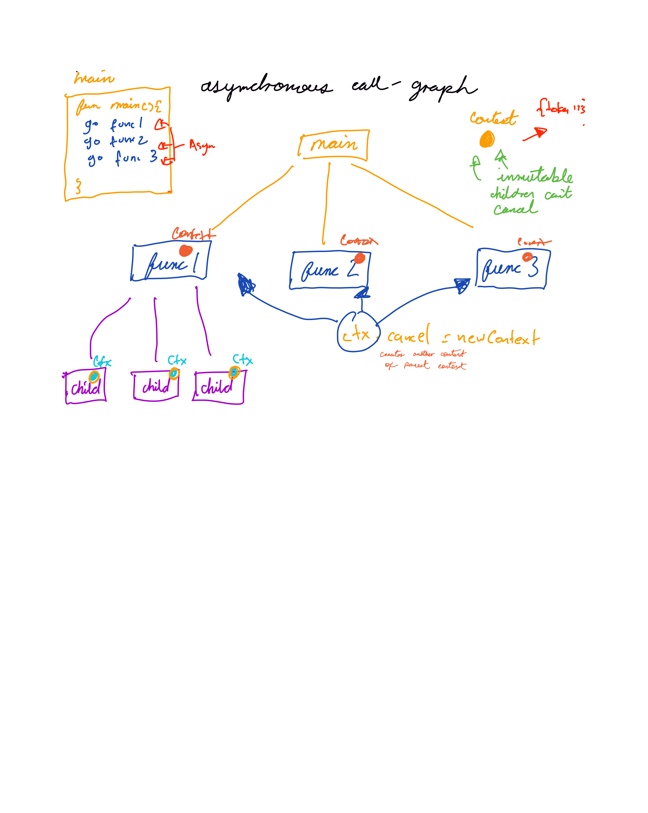

## Go

### Context

#### core rules
- Contexts form a tree
- Context cancellation authority flows downward, not upward
- Ownership flows upward
- Any function can derive a child context and cancel that child
- Cancelling a child does not affect the parent (a child can't cancel a parent)
- If a parent is being cancelled, all descendants will be cancelled
- Goroutines cooperate by checking ctx.Done() 


#### important
```
Context doesn’t stop code.
Code must observe context.
```

context e.g 
```text
main
 └── server
      └── request
           └── db call
```

basic project e.g
```text
main (root ctx)
 ├── server
 │    └── request (per request ctx)
 │         └── db call
 └── scraper (StartScraping)  // background loop
      └── scrape job (per feed / per tick)
           ├── http fetch
           └── db call
```


***diagram***


***Examples***
- ctx, cancel = WithCancel(ctx)
- ctx, cancel = WithDeadline(ctx) -> e.g until 3pm *(will cancel with cancel func or deadline)*
- ctx, cancel = WithTimeout(ctx) -> e.g similar, "you can't run more than 10 minutes" *(will cancel with cancel func or deadline)*


***project context structure more defined***
```text
main app context (ctxApp)  <-- cancelled by SIGTERM/Ctrl+C
├─ HTTP server
│   └─ per-request context (r.Context()) <-- cancelled on client disconnect / server shutdown
│       └─ db/http calls using r.Context()
└─ scraper (StartScraping(ctxApp))
    └─ worker per feed job
        └─ per-feed context (optional timeout) derived from ctxApp
            └─ http fetch + db writes using feedCtx
```

* * * 

***comparison to see differneces***:
- Go: 
     - standard composable operation lifetime object (Context) → ensures ownership, obviousness, predictability. (is not elegant or clever but *correct*)
- Python: 
     - sync world, timeouts, cancellation is external (no standar 'context' object that propagates everywhere)
     - async (asyncio) → cancel task, etc
     - trio / AnyIO (kind of similar to go - haven't used this.)
- JS/TS:
     - AbortController/AbortSignal → overall not used in this language, eveyrhting runs on event loop which hides cancellation problems. 
- JAVA:
     - cancellation + timeouts. e.g Thread.interrupt() → interruption is leady, error-prone, messy. Heavily framework-dependent.
- C:
     - can do it manually, use signals for shutdown. Not required.


### Where context should be passed

- Boundaries
     - HTTP handlers (r.Context())
     - gRPC handlers
     - CLI commands
     - Background workers
     - Cron/schedulers

- I/O
	- Database calls
	- HTTP requests
	- Message queues
	- File/network operations

- Long-running or retrying operations
	- Scrapers
	- Pollers
	- Workers
	- Batch jobs
